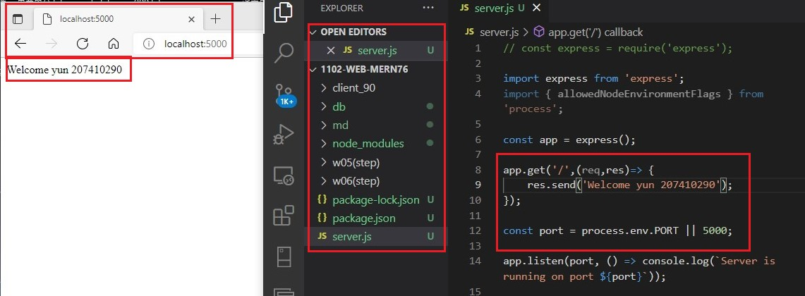
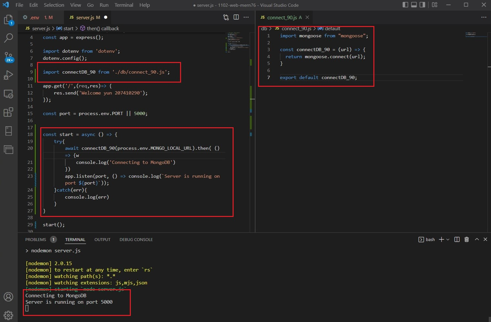
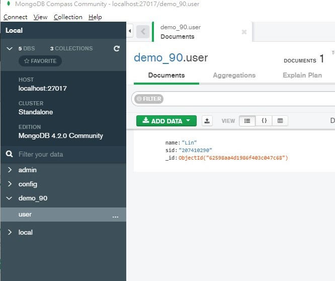

### P1: create a exxpress web server with route

### P2: connect MongoDB server

### P1: Use MongoDB to create database demo_90 and collection user, enter one document that has your name and sid

